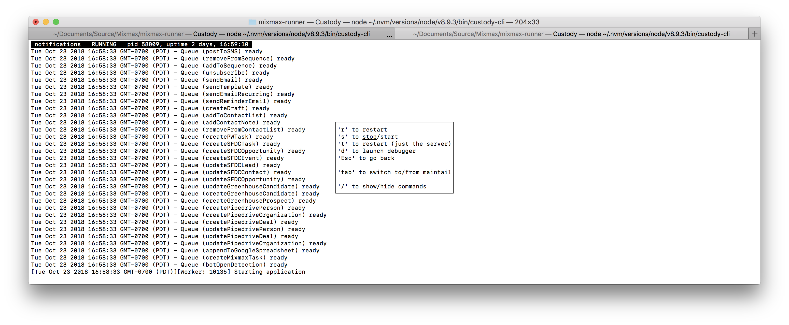

# custody-plugin-command-restart-server

Out of the box, [custody] lets you restart an entire process managed by Supervisor by pressing 'r'
when viewing process details:



However, if you're using Supervisor for local development of microservices, the processes launched
by Supervisor are probably not the servers themselves but rather build processes, which in turn
launch the servers. The process tree might look something like this:

```
supervisord
  - gulp (using gulp-nodemon)
    - node
```

Restarting the "supervised" process is in this case needlessly expensive. You might only want to
restart the server (perhaps after updating Node modules) and end up waiting for `gulp` to rebuild a
[large amount of client-side JS].

Luckily, your build process probably watches server files and restarts the server if they change.
This custody plugin can trigger those watchers on command.

## Installation

```sh
npm install -g @custody/plugin-command-restart-server
```

Then launch `custody-cli settings` and add "@custody/plugin-command-restart-server" to your
`.custodyrc`. Finally, restart `custody-cli` to get it to pick up the new plugin.

## Usage

After opening a process' details in custody


press 't' to restart the server. If you wish to assign a different key, for instance "s", edit
the "@custody/plugin-command-restart-server" line in your `.custodyrc` to look like the following:

```json
{
  "plugins": [
    ["@custody/plugin-command-start-debugger", {
      "key": "s"
    }]
  ]
}
```

### How it works

This plugin assumes that your main server file is called `app.js`, and that your build process
will restart the server if that file changes. So, when you invoke the command, this plugin
executes `touch app.js`. (This does not add or remove any content from your file, just updates
the last-modified timestamp, which is sufficient to trigger file watchers like gulp-nodemon).

## Contributing

We welcome bug reports and feature suggestions!

[custody]: https://github.com/mixmaxhq/custody/
[large amount of client-side JS]: https://github.com/mixmaxhq/multibuild/
